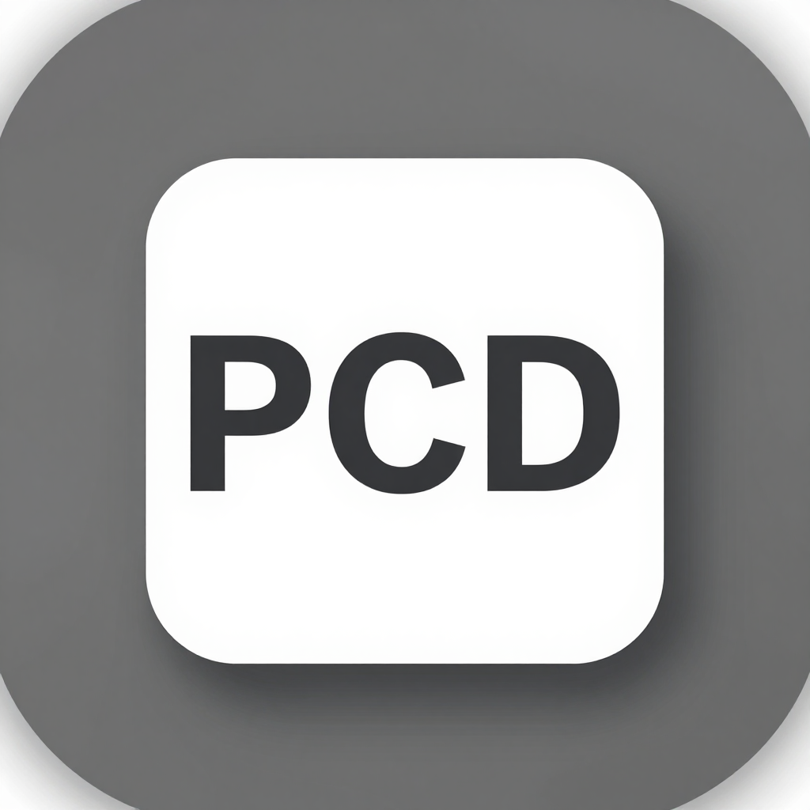

<div align="center">
  
  <h2>Any2Pcd</h2>
  <h3>Text/Binary Point Cloud to PCD Converter (FasterEdge Point Cloud Tool)</h3>
</div>

### 1. Introduction

- Any2Pcd is a point cloud format converter written in Go: it converts **bin / text / CSV / PCD** point cloud files into standard **PCD v0.7** (PCL Point Cloud Data) files. Pure standard library implementation, zero third-party dependencies.

- Key differences from common point cloud tools:
  - **Order preservation**: conversion strictly writes points in their **original input order** with no sorting/dedup/reordering. For timestamped lidar bin (e.g. `x y z timestamp`, 4×float32 per point) use `-fields "x,y,z,timestamp"` to preserve the timestamp field as a PCD field.
  - **UTF-8 without BOM**: output files are UTF-8 (no BOM); the PCD content is an ASCII subset, independent of system locale/encoding — decoding is identical in any environment.
  - **Auto detection**: input format is recognized by extension and content — no need to manually specify `-from`.

### 2. Supported Inputs

| Input | Description |
| --- | --- |
| `.bin` | Binary point cloud, N×float32 per point (little-endian). Automatically tries 3..16 fields and takes the first that divides the file size; the common KITTI 4-field layout is auto-named `x y z intensity` |
| `.txt` / `.xyz` / no extension | Whitespace/Tab-separated numbers per line, auto-named by column count (3→xyz, 4→xyz+intensity, 6→xyz+rgb, 7→xyz+intensity+rgb, others→featureN) |
| `.csv` | Comma-separated (same as text) |
| `.pcd` | Already-PCD files (ASCII or binary, 4-byte numeric fields only) — for re-encoding, e.g. binary→ascii, field reduction |

### 3. Usage

```
any2pcd [options] [files...]   # convert files, defaults to stdin
cat x.bin | any2pcd -from bin  # read from stdin
```

| Option | Meaning |
| --- | --- |
| `-from format` | Input format: `auto` (default)|`bin`|`text`|`csv`|`pcd` |
| `-fields names` | Field names (comma-separated), e.g. `x,y,z,intensity` or `x,y,z,timestamp`; also determines the number of fields per point for bin |
| `-binary` | Write binary PCD (`DATA binary`, little-endian float32, smallest size) |
| `-output file` | Output file (single input only; default stdout) |
| `-outdir dir` | Output directory for multiple inputs (default `.`, writes `<basename>.pcd`) |
| `-strict` | Strict mode: NaN/Inf/bad lines/column mismatches fail (exit 1) |
| `-skip-bad` | Skip bad lines (text/csv only; fails by default) |
| `-version` | Print version |

### 4. Examples

```sh
# KITTI-style bin (x y z intensity) → ASCII PCD
any2pcd velodyne_000001.bin > velodyne_000001.pcd

# Lidar bin (x y z timestamp) → PCD preserving the timestamp field (order preserved)
any2pcd -fields "x,y,z,timestamp" lidar_frame.bin > lidar_frame.pcd

# Binary output (smaller files, faster parsing)
any2pcd -binary lidar_frame.bin > lidar_frame_binary.pcd

# Text point cloud → PCD
any2pcd points.xyz > points.pcd

# CSV → PCD
any2pcd -from csv scan.csv > scan.pcd

# Re-encode PCD binary as ASCII
any2pcd -from pcd in_binary.pcd > out_ascii.pcd

# Batch conversion into a directory
any2pcd -outdir ./out scan1.bin scan2.bin scan3.bin
```

### 5. Output Format

```
# .PCD v0.7 - Point Cloud Data file format
VERSION 0.7
FIELDS x y z intensity
SIZE 4 4 4 4
TYPE F F F F
COUNT 1 1 1 1
WIDTH <point count>
HEIGHT 1
VIEWPOINT 0 0 0 1 0 0 0
POINTS <point count>
DATA ascii|binary
```

- All field types are 4-byte `F` (float32).
- ASCII mode writes one point per line, space-separated, with shortest lossless representation (`%g`) to guarantee float32 round-trip fidelity.
- binary mode body is N×4 bytes little-endian float32 per point, compatible with common bin readers.

### 6. Constraints

- Stdin is fully read into memory (point cloud sizes are usually manageable; for very large files prefer file input — memory scales with file size).
- `-output` is single-input only; use `-outdir` for multiple files.
- PCD input supports only 4-byte numeric fields (`F`/`U`/`I`); double/multi-COUNT are not supported — convert double fields with another tool first.
- Field names allow ASCII letters/digits/underscore only (PCD spec compatible, also keeps output UTF-8 safe).

### 7. Build & Test

Requires host Go 1.25+:

```sh
go build -trimpath -ldflags="-s -w" -o any2pcd .
go test ./...      # unit tests (bin round-trip / order / no-BOM / field mapping / PCD re-encode)
```

When enabled via FasterEdgeOS `OVERLAY_BUNDLES` it can be packaged as a system bootstrap tool (offline upgrades can point `ANY2PCD_SOURCE_DIR` at a local new source directory).

### 8. License

Apache-2.0 (consistent with the DontCrack family), see the repository LICENSE.

Current version: **1.0.20260913**